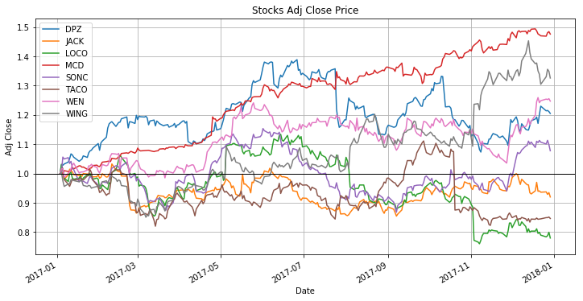
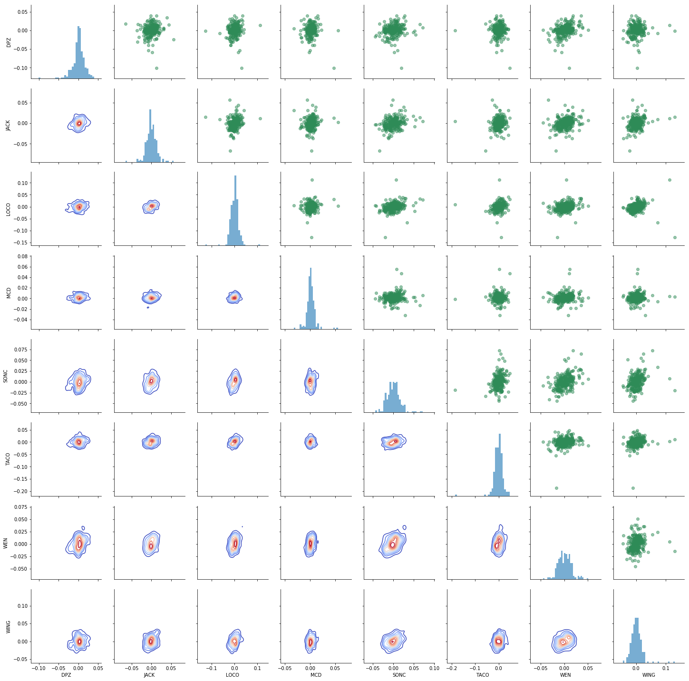

# Trading Strategies in Emerging Markets Coursera
## Online course:
https://www.coursera.org/specializations/trading-strategy

<h3 align="left"> Coursera:</h3>

 </a>  </a>  
  

This is online project in Trading-Strategies-in-Emerging-Markets-Coursera and "Design your own Trading Strategy."

# Prerequistes
Python 3.5+

Jupyter Notebook Python 3  

## Authors  
### * Tin Hang

